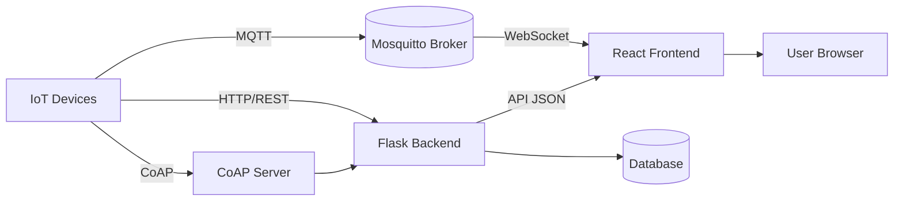

# TeloT Platform 🌐

**Open-Source IoT Platform** dengan integrasi multi-protokol (MQTT, HTTP, CoAP) untuk manajemen perangkat skala besar.

## 🛠 Tech Stack
| Komponen         | Teknologi                  |
|------------------|----------------------------|
| **Frontend**     | React, Bootstrap, MQTT.js  |
| **Backend**      | Flask, Python 3.9+         |
| **Database**     | PostgreSQL                 |
| **Realtime**     | Mosquitto (MQTT Broker)    |
| **CoAP Server**  | aiocoap                    |
| **Container**    | Docker, Docker Compose     |

## 📱 UI/UX Prototype
Lihat desain antarmuka pengguna di Figma: [Klik di sini]([https://www.figma.com/file/your-prototype-link](https://www.figma.com/proto/9k1SzoRPUP94WtS0FbIx4T/Untitled?node-id=28-494&p=f&t=ojdEAnnnytXJqMqs-1&scaling=min-zoom&content-scaling=fixed&page-id=0%3A1&starting-point-node-id=28%3A494))

## 📐 Arsitektur Sistem

